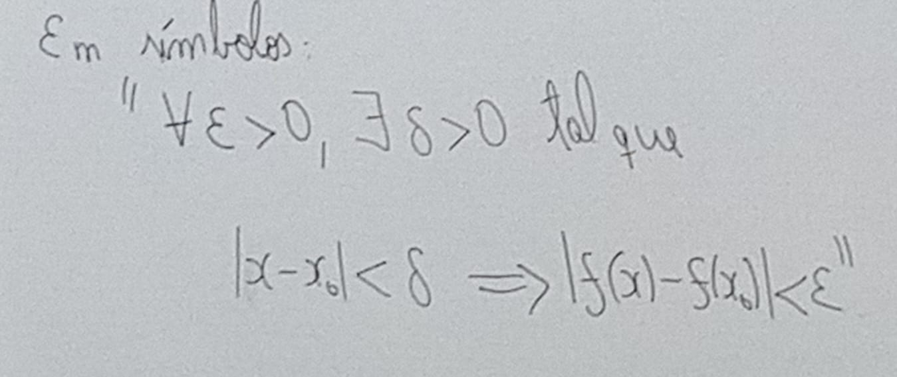

[&larr;](../index.md)

# Continuidade e Limite

## Continuidade(Ideia intuitiva)
- Seja f: Df -> R
- Uma função, intuitivamete, dizer que f é contínuo num ponto xo e Df é, quando não há saltos no grafico de f no ponto xo.

- Por outro lado, quando f não é contínuo em xo, acontece algo como ilustrado a baixo.

### Definição:
Seja **f** uma função *xo* E *Df*. Dizemos que **f** é contínua em *xo*, quando "para todo *epsilon* > 0 dado, existir *delta* > 0 tal que **|x-xo| < delta, implicar |f(x) - f(xo)| < epsilon**"

Exemplo1:
f(x) = 3x + 1

Mostre que *f* é contínua em *xo* = 1.

Solução:

**Dado** *Epsilon* > 0, precisamos encontrar *Delta* > 0, tal que:

Exemplo2:

É possível notar que há um salto no gráfico de *f* no ponto *xo = 0*. Portanto, *f* não é contínua em *xo = 0*.

Basta escolher:
0 < *epsilon*> < 2 - 1 = 1 

por exemplo, *epsilon* = 1/2. Apartir daí, para *delta* > 0, escolha *x * delta* = 8/2.
Com isso observe que:

 - |*x * delta* - xo| = |8/2 - 0| = |8/2| < *delta*
 - |f(*x * delta*) - f(0)| = |2 - 1| == 1 > 1/2 == *epsilon*