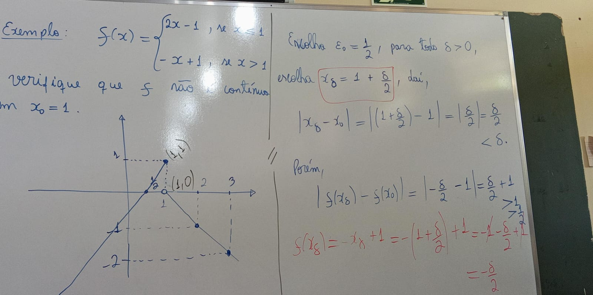
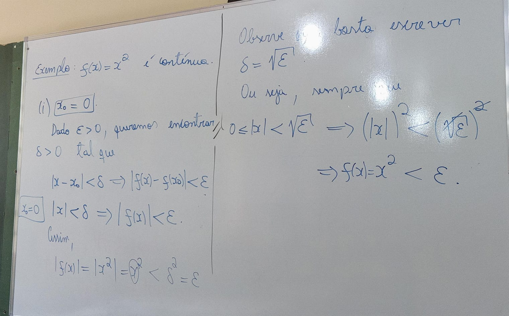

[&larr;](../index.md)

# Continuidade:
**f: Df -> R** é continua em **xo E Df**.

## (i) xo == 0

## (ii) xo != 0
Dado **Epsilon > 0**, precisamos encontrar **Delta > 0** tal que:
    **|x - xo| < Delta -> |f(x) = xo| < Epsilon**

*Dica: Quadrado da diferença: ((a^2) - (b^2))== (a-b) * (a+b):* 
- a == 2
- b == 4
  
logo:
- 4 - 16 == 2 * 6
- 12 == 12

# Limite
Dada uma função **f**, dizemos que:   
- **lim f(x) = L**
- **x->xo**
quando:
- Vcortado Epsilon > 0, Einvertido Delta > 0 tal que:
- **0 < |x-xo| < Delta -> |f(x)-L| < Epsilon**

## Exemplo:
- **lim(3x - 1)**.
- **x->1**
- logo lim(1) ~= 2

