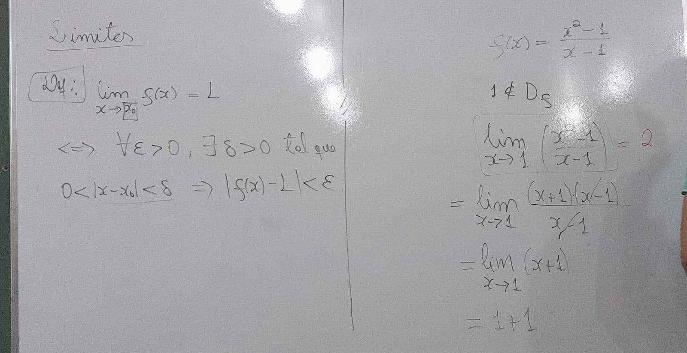

[&larr;](../index.md)

# 18/04/2024

## Limites

- Exemplo: g(x) = {
                    - (x^2 - 2) / (x + sqrt(2)), se x != - sqrt(2)
                    - 1, se x = - sqrt(2)
                - }
  Qual o **lim** de g(X) ?

### Proposição

Seja **f** uma função e **xo E Df**, então **f** é contínua em **xo** se e somente se o limite de f, quando x tende a xo, é necessariamente o proprio f(xo)

### Propriedades de limite

1) se lim (f(x)) = L1 e x->xo | lim(g(x)) = L2 e x->xo, então lim([f(x)+g(x)]=L1+L2) e x->xo
2) Tambem vale: lim(f(x)*g(x)) = L1 * L2 e x->xo
3)  Quando L2 != 0, então: lim (f(x)/g(x)) = L1/L2 e x->xo
4)  k E R, então: lim(k.f(x)) = k.L1 e x->xo

### Exemplos de Funções Contínuas

1) Funções polinomiais (São Continuas)
2) Funções racionais (Fração de Dois Polinomios)

