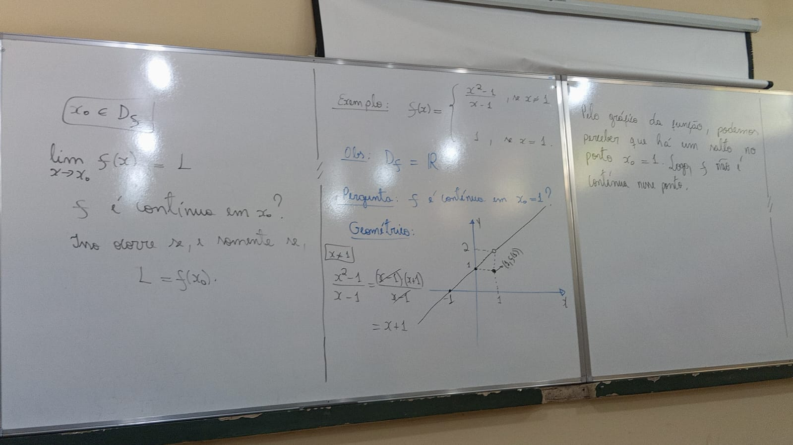
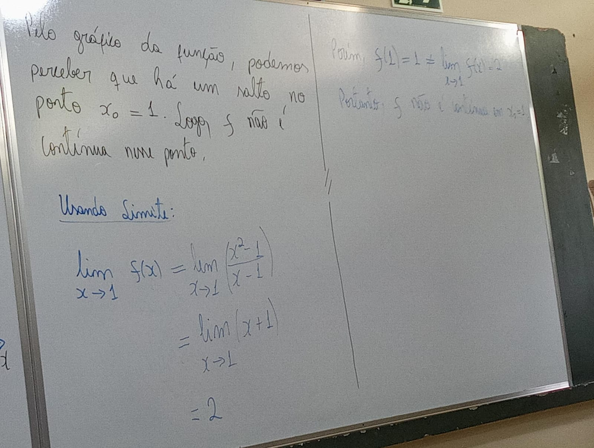
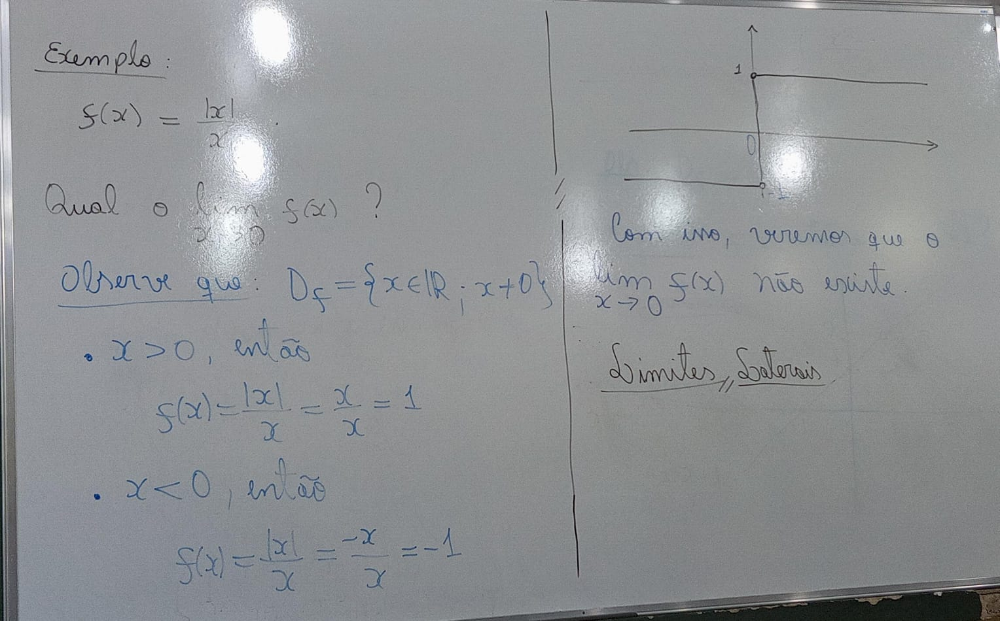
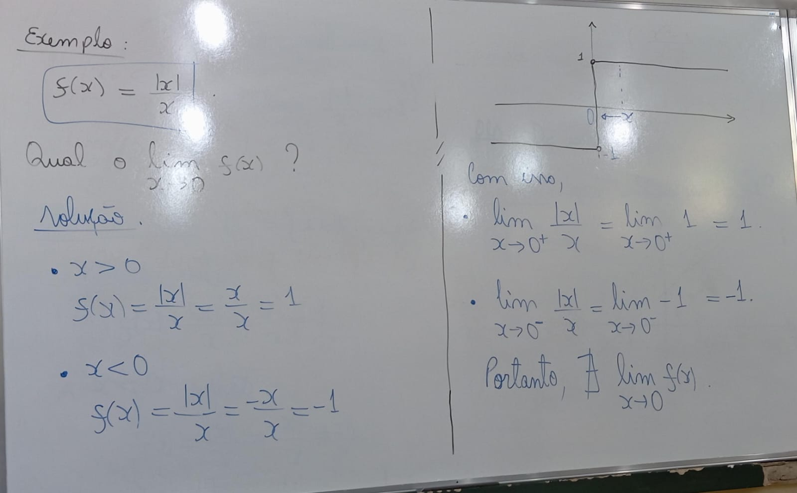
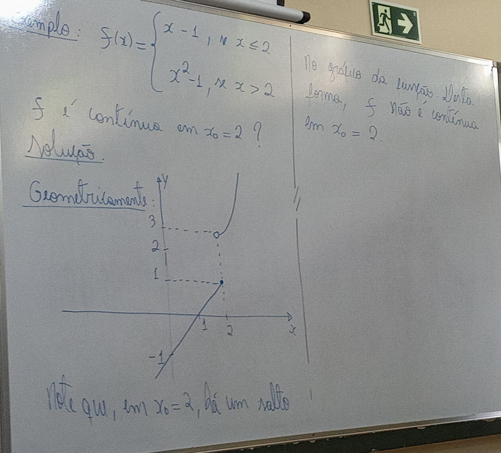
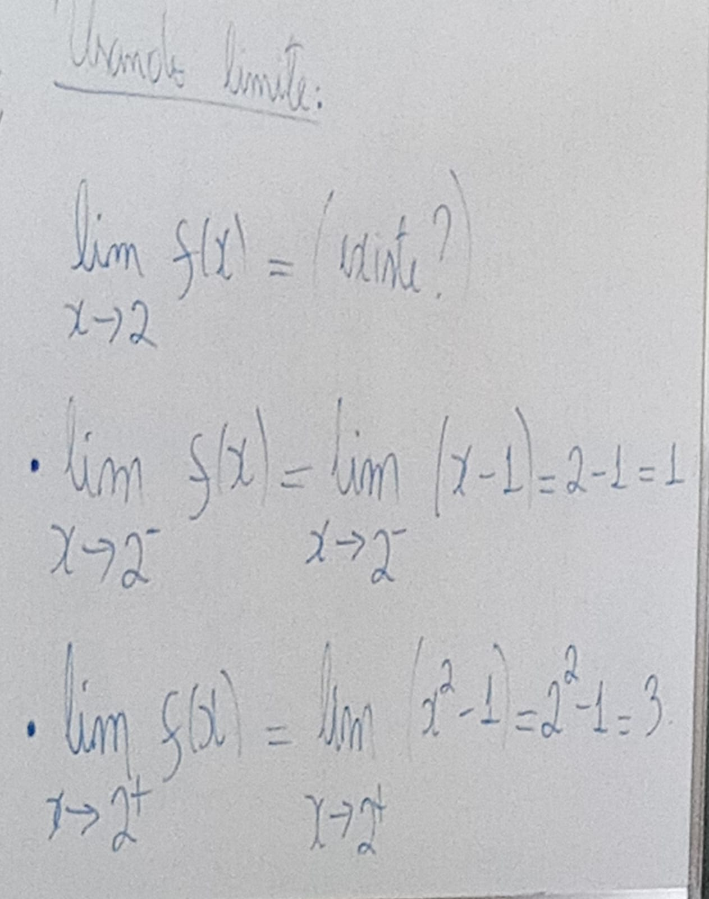

# [&larr;](../index.md) Aula 10

lim(f(x)) = L
x->xo

*f* é contínuo em xo ?
isso ocorre se, e somente se, **L = f(xo)**.

exemplo:
    f(x) = {(x^2 - 1) / x - 1}

## Limites Laterais

Dizemos que o limite lateral à direita de f é igual a L, quando:

    lim(f(x)) = L
    x-> xo+

De modo semelhante, dizemos que o limite lateral à esquerda de f é igual à L (quando x->xo), quando:

    lim(f(x)) =L
    x-> xo-

Teorema: Seja *f* uma função se lim(f(x)) = L1 e lim(f(x)) = L2.
                                x-> xo+     x-> xo-

Então, o [lim(f(x)), x-> xo] existe se, e somente se, [lim (f(x)), x-> xo+] = [lim(f(x)), x-> xo-], ou seja, L1=L2.

Com isso, [lim(f(x)), x->2], portanto, nesse caso, *f* não é contínuo em xo = 2.
