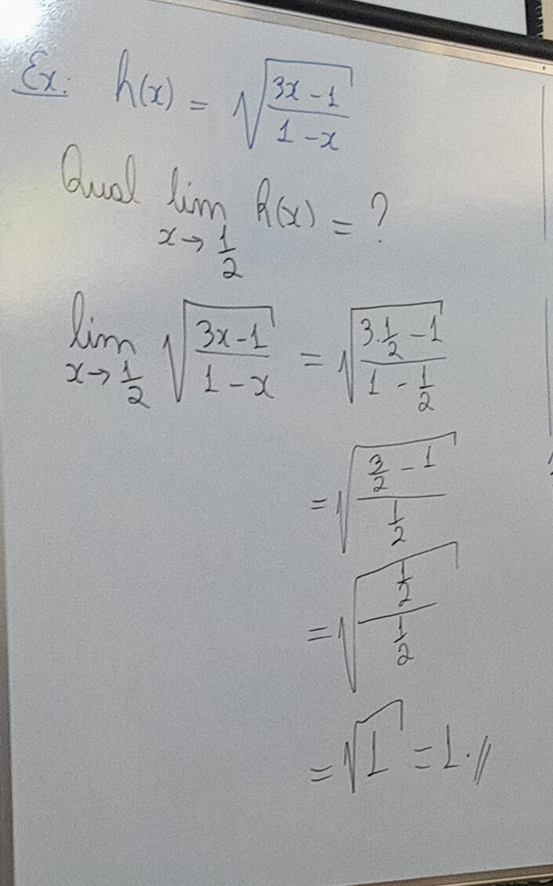

# [&larr;](../index.md) Aula 11

## Limite de funções compostas

Sejam *f* e *g* duas funções, com *g* contínua em seu domínio. Se *lim(f(x), x->xo)* = *c* *E* *Dg*, então:

lim(g(fx)) = g(c)
g(lim(fx), x->xo)

ex1:

h(x) = (2 + x)^3
g(y) = y^3
f(x) = 2 + x

Logo, para gerarmos h, seguimos o seguinte processo

h(x) = (gof)(x)
    g(f(x))
    f(x)^3
    (2 + x)^3

ex2:

Recebemos *h* e com base nele geramos *g* e *f*

- h(x) = sqrt((3x-1)/(1-x))
- g(y) = sqrt(y)
- f(x) = (3x - 1 )/ (1 - x)

Na pratica temos isso:

h(x) = g(f(x))

sqrt(f(x))

sqrt((3x-1)/(1-x))

ex3: Calcule: lim(h(x), x->1)

- h(x) = (2 + x)^3
- g(y) = y^3
- f(x) = 2 + x

lim(f(x), x->1)

lim(2 + x, x->1)

2 + 1

3

Agora aplicamos o resto da formula (g(y))
lim(g(3))
lim(27, x->1)
27

ex4:

ex5: calcule o lim((((3 - x^2)^4 - 16) / x^2 -1), x->1)

h(x)
