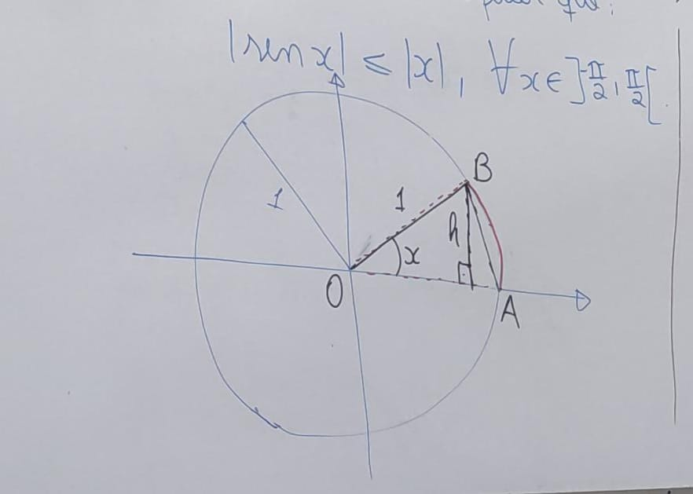

# [&larr;](../index.md) Aula 12

## Teorema do Confronto

Sejam f, g, h três fun~ções e suponha que existe r > 0 tal que `f(x) <= g(x) <= h(x)`

```math
para todo x E R, com 0 < |x - xo| < r.
```

com isso , se:

```math
lim(f(x), x->xo) = lim(j(x), x->xo) = L
```

## Algumas aplicações

1. Seja `f` uma função tal que `|f(x)| <= x^2, para todo x E R`.

   a) Calcule, caso exista, lim(f(x), x->0)

   b) `f` é contínua em xo=0? porquê ?

    Solução:

    
    
    

2. Seja `g` uma função definida em R e tal que `-x^2 + 3x <= g(x) <= (x^2 - 1) / x - 1`

    para todo x != 1. Calcule o lim(g(x), x -> 1)
    

## Continuidade das funções Sen e Cos

Para entender alguma coisa sobre isso, deve-se pesquisar mais sobre Geometria Euclídiana()

Primeiro, vamos verificar que:



Observe que:


