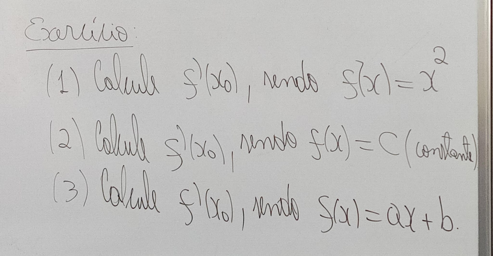

# [&larr;](../index.md) Aula 16

## Derivadas

### Significado Físico

Seja ``f(t)`` a função que descreve o movimento de uma particula em função do tempo ``t``.
Com isso, sabemos que a velocidade média da partída entre t e t0 é: ``Velocidade média = ( (f(t) - f(t0)) / (t-t0) )``

Qual seria a velócidade instantânea da particula no instante de tempo t0?

No Caso, a velocidade instantânea será obtida, ao considerar o limite: ``lim ((f(t) - f(t0)) / (t-t0) , t->t0)``

Conclusão: fisicamente a derivada será a velocidade instantânea da partícula.

### Significado Geométrico

No caso, ao considerar o limite:

então obtemos o coeficente angular da reta tangente ao gráfico de `f` no ponto `x0`. Ou seja, `y - f(X) = f´(x0)*(x - x0)`

Definição: Seja `f` uma função `x0 E Df`. A derivada de `f` em `x0` , denotada por `f´(x0)`, é o lim ( (f(x) - f(x0) ) / x - x0, x -> x0)

quando o limite existe e é finito.

