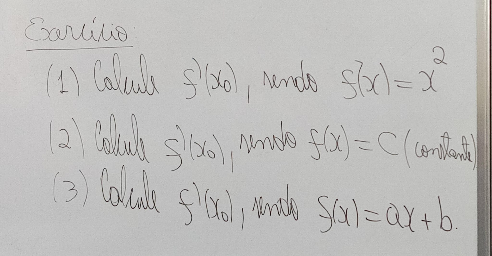
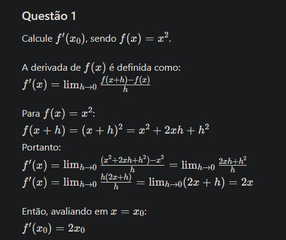
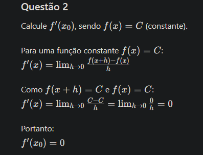
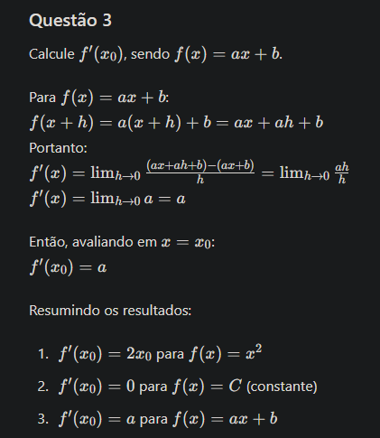

# [&larr;](../index.md) Aula 17

## Exercício

### Ex

Ex: f(x) = 2x - 2, xo = 1
Calcule f`(1)

Solução

f`(1) = lim((f(x) - f(1) / (x-1), x->1))

= lim((2x - 2) - (2*1 - 2) / (x - 1), x->1)

= lim((2x - 2) / x - 1, x->1)

= lim(2*(x - 1) / x - 1, x->1)

= 2

## Q1, f`(x), sendo f(x) == x^2

lim((f(x) - f(x0) / (x-1), x->1))
lim((x^2 - x0^2 / (x-1), x->1))
