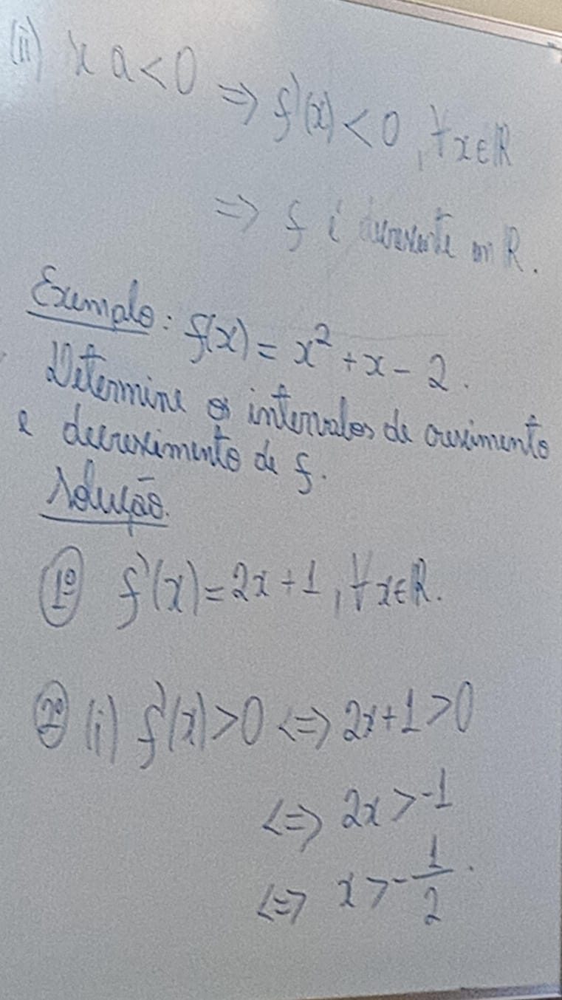

# [&larr;](../index.md) Aula 20

## Aplicação da Derivada

### Teorema do Valor médio (TVM)

Teorema(TVM) seja f: [a,b] -> |R contínua e derivável ]a, b[ . Então, existe c E] a, b [ tal que:

- Intervalo de Crescimento e de Decrescimento com o aplicação do TVM, obtemos o seguinte resultado:
    
    
    
    
    
    
    
    
