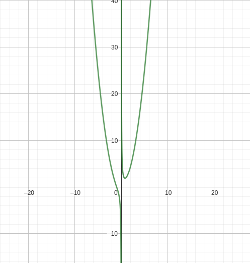

# [&larr;](../index.md) Aula 21

## Exercício

### Pág 322

- 1
  - d
    - 
    - 
    - 
- 9
  - a
    - 

## Concavidade e Ponto de Inflexão

### Teorema

Seja f uma função derivável até 2ª ordem no intervalo aberto I.

