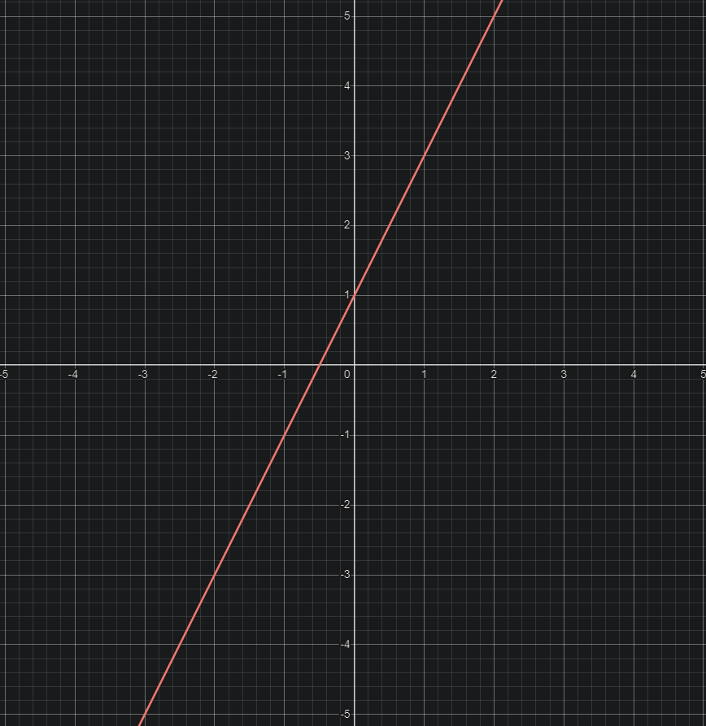

# 15/04/2024 -> 18/04/2024

Livro do Gidoris "Um curso de cálculo"

## Tarefas

Quesões na página 30 (PDF)

- 1 (a, c)
- 2 (a, d, f, h)
- 3 (a, b)

Questões na página 41(PDF)

- 2 (b)
- 3 (b, c)

Questões na página 69(PDF)

- 4 (d, o, p)
- 5 (a, b)
- 6 (b)
- 7 (c)
- 8 (b, e, i)
- 9 (c, e, h)

## Na Prática

### Página 30(PDF)

1) Resolva as inequações.

a) 3x + 3 < x + 6

**Resposta:**

- Começamos subtraindo **x** de ambos os lados da igualdade

(3x - 3x + 3) < (x - 3x + 6)

(3 < -2x + 6)

- Agora subtraimos 3 de ambos lados

(3 - 3) < (-2x + 6 - 3)

0 < (-2x + 3)

- Agora somamos +2x para igualar

(0 + 2x) < (-2x + 2x + 3)

2x < 3

- Agora dividimos por 2 para eliminar o 2x

(2x / 2) < (3 / 2)

- **Resultado:** **x < 1.5**

c) 2x − 1 ≥ 5x + 3

**Resposta:**

- (2x - 5x - 1) >= 5x -5x + 3

- (-3x -1) >= 3

- (-3x -1 + 1) >= (3 + 1)

- -3x >= 4

- -x >= 4/3

- -x >= 1,33

- **Resultado:** **x >= -1.33**

1) Estude o sinal das expressões

a) 3x - 1

(ZERO)

- Primeiramente vamos criar um termo de igualdade para definir o que estamos buscando.

(3x - 1) = 0

- Agora começamos eleminando os inteiros

(3x - 1 + 1) = 0 + 1

3x > 1

- Agora dividimos por 3 para sobrar apenas x:

3x / 3 = 1 / 3

x = 0.33

(POSITIVO)

Quando X for Maior que 0.33:

- **X > 0.33**

(NEGATIVO)

Quando X for Menor que 0.33:

- **X < 0.33**

d) 5x + 1

(ZERO)

5x + 1 = 0

5x = -1

x = -1 / 5

x = -0.2

(POSITIVO)

Quando X for Maior que 0.33:

- **X > -0.2**

(NEGATIVO)

Quando X for Menor que 0.33:

- **X < 0.2**

f) (2x + 1) * (x - 2)

h) (2 - x) / (3 - x)

1) Resolva as inequações

a) ((2x - 1) / (x + 1)) < 0

b) ((1 - x) / (3 - x)) >= 0

### Página 41(PDF)

2)Resolva as equações

b) |x + 1| = 3

(CASO POSITIVO)

1 * | X + 1| = 3

X + 1 = 3

X + 1 - 1 = 3 -1

- **X = 2**

(CASO NEGATIVO)

-1 * | X + 1| = 3

-X - 1 = 3

-X -1 + 1 = 3 + 1

-X = 4

-1*(-X) = 4*(-1)

- **X = -4**

1)Resolva as inequações
b) |2x - 1| < 3

(CASO POSITIVO)

2x - 1 < 3

2x -1 + 1 < 3 + 1

2x < 4

x < 4/2

- **x < 2**

(CASO NEGATIVO)

-1 * (2x - 1) < 3

-2x + 1 < 3

-2x + 1 - 1 < 3 - 1

-2x < -2

(-1)*(-2x) < (-1)*(-2)

2x < 2

x < 2/2

- **x < 1**

c) |3x -1 | < -2

(CASO POSITIVO)

3x - 1 < -2

3x < -1

x < -1 / 3

- **x < 0.33**

(CASO NEGATIVO)

(-1) * (3x -1) < -2

-3x + 1 < -2

-3x < -3

3x < 3

x < 3 / 3

- **x < 1**

### Questões na página 69(PDF)

4)Dê o domínio e esboce o gráfico.

d) f(x) = 2x + 1

input = [-2, -1 , 0, 1, 2]

f(input) = [-3, -1, 1, 3, 5]

Logo, Df = {Todos os números reais}

o) h(x) = (x^2 - 1) / (x - 1)

input = [-2, -1 , 0, 2, 3]

h(input) = [-3, 0, 1, 3, 4]

Logo, Df = {Todos os números reais diferentes de 1, pois caso o divisor seja 1, na subtração do -1 resultará em zero. E nas propriedades afirma-se que não pode haver divisão por zero}

################################################################

Simplificando a expressão

((x - 1) * (x + 1)) / x - 1
**Perguntar a matheus na aula**

p) g(x) = (x^2 - 2x + 1) / (x - 1)

5)Considere a função f(x) = |x - 1| + |x - 2|
   a) Monstre que f(x) =
                            -2x + 3 se x <= 1
                            1       se 1 < x < 2
                            2x - 3  se x >= 2

    b) Esboce o gráfico de f

6)Esboce o gráfico.
   b) g (x) = | x | − 1

7)Olhando para o gráfico de f, estude o sinal de f (x).
    c) f (x) = 3x + 1

8)Estude a variação do sinal de f (x).
    b) f(x) = (2x + 3) * (x + 1)

    e) f(x) = (x - 1) / (x + 1)

    i) f(x) = x * (2x - 1) / (x + 1)

9)Determine o domínio.
    c) g(x) = 2x / (x^2 + 1)
    e) h(x) = sqrt(x + 2)
    h) y = sqrt(x / (x+3), 4)
