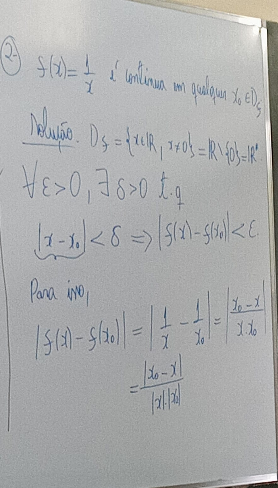
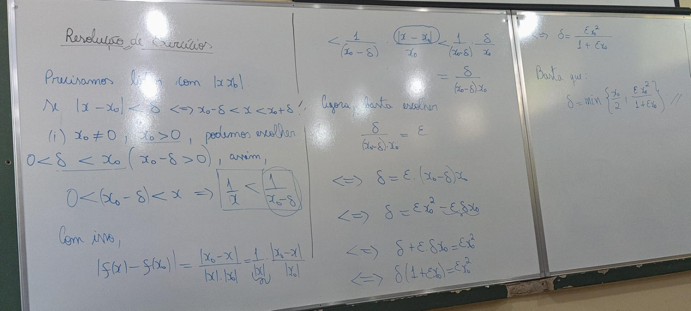
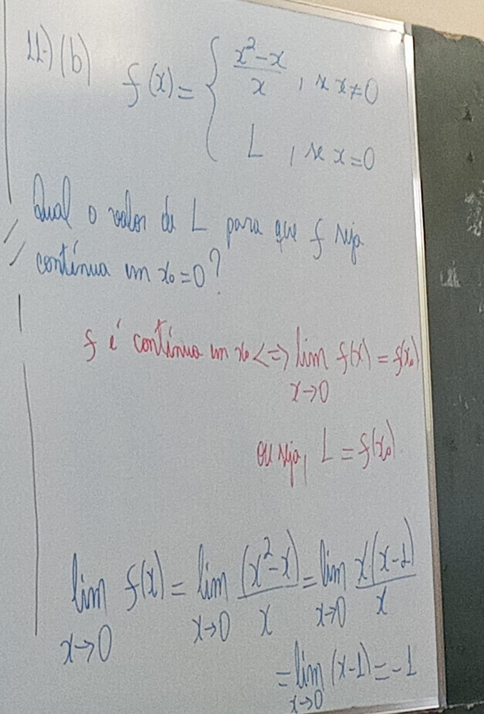
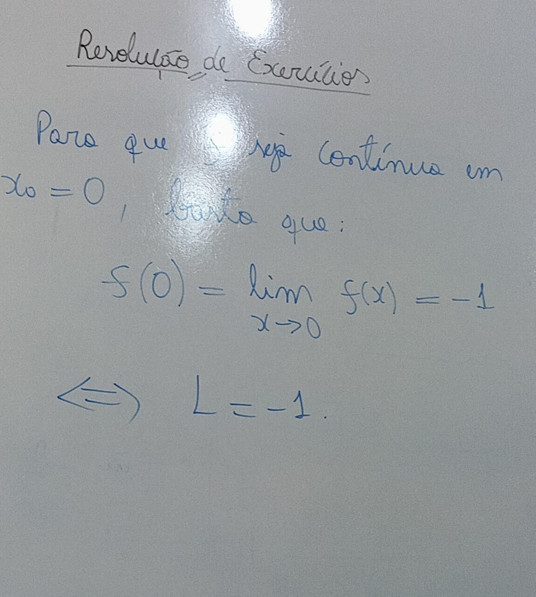
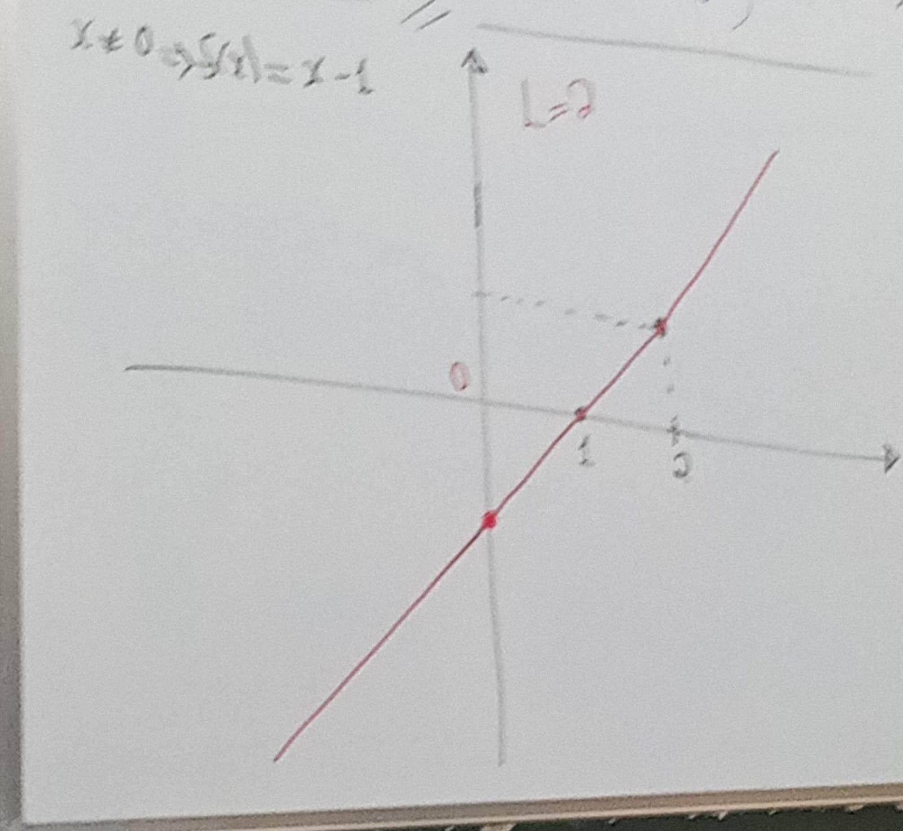
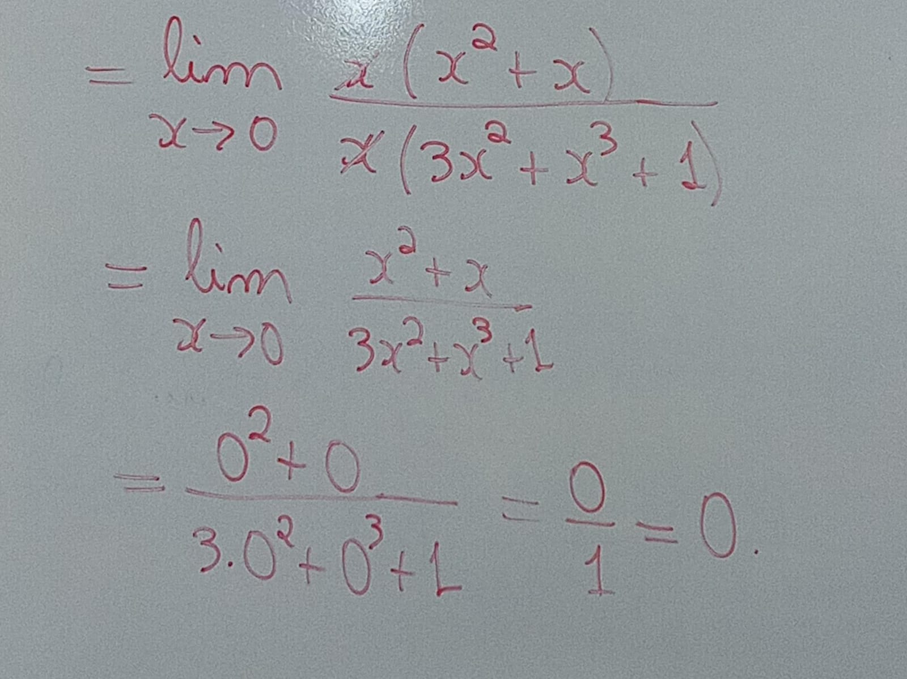

# Exercicio 25/04/2024

1 ) Prove, pela definição, que a função dada é contínua no ponto dado.

- f (x) = 4x − 3 em p = 2
  - Resposta
  - f é contínua em qualquer xo E R
  - Para todo epsilon maior que zero, existe um delta maior que zero, tal que |x - xo| é menor que delta, implicando em: |f(x) - f(xo)| < epsilon
  - Definição na prática
    - |f(x) - f(xo)| = |(ax + b) - (axo + b) |
      - = | ax+b -axo - b |
      - = |ax - axo|
      - = a * (x - xo)
      - = |a| * |x - xo|
      - < |a| * *delta*
      - para concluir: |a| * *delta* = *epsilon*, ou seja, *delta* = *epsilon* / |a|
      - Trocando os valores da questão:
      - *delta* = *epsilon*/4
      - g(x) = x + 1, xo = 2
      - a = 1
      - b = 1
      - xo = 2
      - *delta* = *epsilon*/1 = *epsilon*

2 ) f(x) = 1/x é continua em qualquer xo E Df

solução:

11 b)

13 ) Tentar fazer

1 ) pag 123

f )  lim(-x^2 - 2x + 3)
        x-> -1
= -(-1^2) - 2*(-1) + 3
= -1 + 2 + 3
= 4.
pois, (-x^2 - 2x + 3) é una função polinômial, e portanto, contínua.

o ) lim( (sqrt(x) - 1) / x - 1)
            x -> 1

para x != 1,

(sqrt(x) - 1) / (x - 1) == (sqrt(x) - 1) / ((sqrt(x)^2) - 1^2)

= (sqrt(x) - 1) / (sqrt(x) - 1) == (sqrt(x) - 1) * (sqrt(x) + 1)

= 1 / (sqrt(x) + 1)

assim, lim((sqrt(x) - 1) / x - 1) == lim(1 / sqrt(x) + 1)

= 1/ (sqrt(1) + 1)

Resultado: **= 1/2**

b )

lim( (x^3 + x^2)/ 3x^3 + x^4 + x)
x->0

