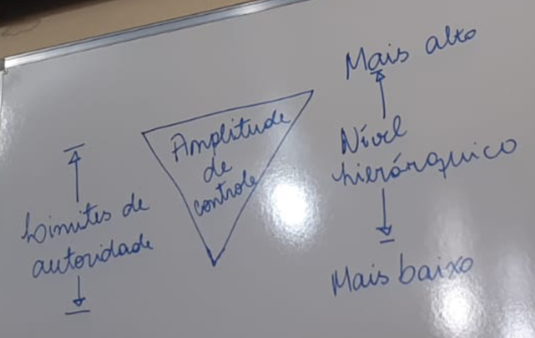

# [&larr;](../index.md) Aula 08

## Sistema de responsabilidade

Responsabilidade é a atuação profissional de qualidade no trabalho e de busca de resultados.

### Aspectos Básicos

- Departamentalização

- Linha e assessoria

- Descrição das atividades

## Sistema de autoridade

Resultado da distribuição do poder.

### Constituído por

- Amplitude administrativa ou de controle

- Níveis hierárquicos

- Delegação

- Centralização ou descentralização

## Sistema de comunicações

Comunicação é o processo interativo que dados, informações e orientações são transacionado entre pessoas.

### No sistema de comunicações deve ser considerado

- O que deve ser comunicado
- Como deve ser comunicado
- Quando deve ser comunicado
- De quem deve vir a informação
- Para quem deve ir a informação
