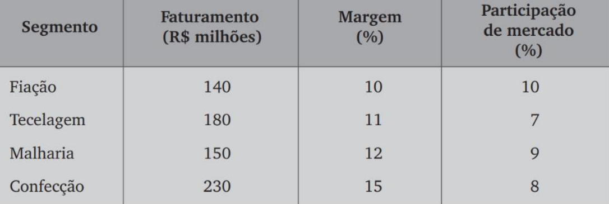
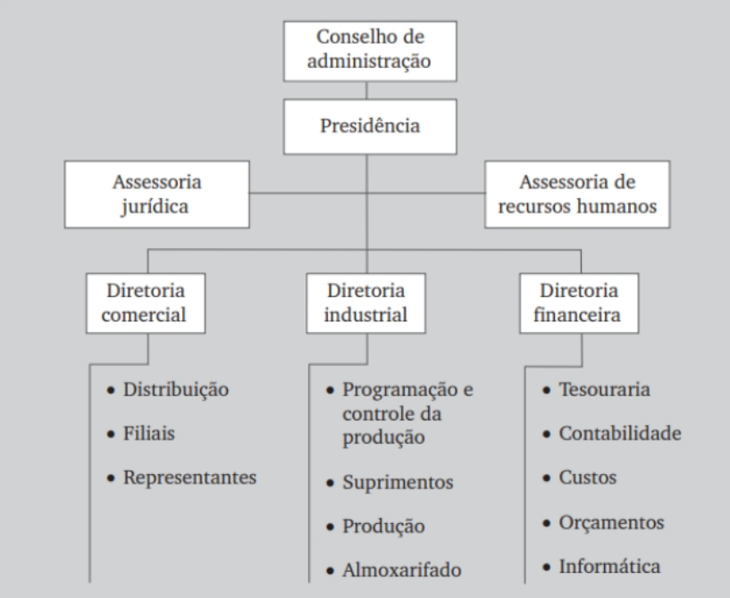

# Análise da Estrutura Organizacional da Portpholio – Indústria e Comércio S.A

A Portpholio – indústria e Comércio S.a. é uma sociedade anônima de capital fechado pertencente a duas famílias, cujos patriarcas fundaram a empresa em 1943. Atualmente, a empresa está na terceira geração quando se considera sua administração e, embora os conflitos não sejam fortes, alguns membros das duas famílias começam a considerar a hipótese de repensar a estrutura organizacional, bem como uma possível profissionalização da alta administração.

A Portpholio atua nos segmentos de fiação, tecelagem, malharia e confecção, com um faturamento médio anual de R$ 700 milhões e com os resultados apresentados a seguir:

Neste momento, é solicitado um primeiro serviço que você deve efetuar como
consultor da Portpholio:

**Fazer um levantamento e identificar cinco funções para uma das unidades organizacionais apresentadas no organograma da empresa, sendo uma de planejamento, uma de organização, uma de direção, uma de administração de recursos humanos e uma de controle e avaliação.**

Atualmente, uma família está com os cargos de Presidente do Conselho de Administração, Assessor Jurídico, Assessor de Recursos Humanos e Diretor Industrial. A outra família está com os cargos de Presidente Executivo, Diretor Comercial e Diretor Financeiro. O organograma geral resumido da Portpholio é apresentado a seguir:

O segundo serviço solicitado a você é:

**Realizar uma análise da estrutura organizacional com a correspondente proposta de uma possível nova estrutura, tendo em vista os objetivos de aumentar o faturamento de cada um dos negócios, bem como a participação de mercado.**

No momento atual, as margens proporcionadas pelos quatro segmentos de atuação da Portpholio podem ser consideradas adequadas para a realidade do setor têxtil, bem como para a realidade brasileira. Entretanto, existe outro objetivo a ser alcançado, que é a efetiva atuação no mercado internacional, principalmente no Mercosul, sendo que atualmente essa participação é insignificante.

Se você julgar necessário, pode acrescentar informações e situações para o caso apresentado, desde que não altere os diversos aspectos evidenciados ao longo do texto.

## Resolução

Solução para o primeiro serviço:

### Funções para a Unidade Organizacional "Diretoria industrial" da Portpholio Indústria e Comércio S.A

- Planejamento:
  - Gerente de Planejamento da Produção: Responsável por elaborar e implementar o plano de produção da unidade, incluindo a definição de metas, prazos, recursos e indicadores de desempenho. Deve realizar análises de mercado, identificar gargalos e oportunidades de melhoria, além de acompanhar o desempenho da produção e propor ajustes no plano quando necessário.
- Organização:
  - Supervisor de Produção: Responsável por organizar e supervisionar as atividades de produção, garantindo o cumprimento dos prazos, a qualidade dos produtos e a segurança dos trabalhadores. Deve gerenciar a equipe de produção, definir as tarefas e responsabilidades de cada membro, e monitorar o desempenho individual e coletivo.
- Direção:
  - Diretor de Produção: Responsável pela liderança da unidade de produção, definindo a estratégia e os objetivos da área. Deve acompanhar o desempenho da produção, identificar oportunidades de melhoria e tomar decisões estratégicas para otimizar os processos e aumentar a produtividade.
- Administração de Recursos Humanos:
  - Analista de Recursos Humanos para Produção: Responsável por gerenciar os recursos humanos da unidade de produção, incluindo a seleção, recrutamento, treinamento e desenvolvimento dos trabalhadores. Deve administrar a folha de pagamento, benefícios e demais aspectos relacionados à gestão de pessoas na área de produção.
- Controle e Avaliação:
  - Gerente de Controle de Qualidade: Responsável por garantir a qualidade dos produtos da unidade de produção, implementando e monitorando os processos de controle de qualidade. Deve realizar inspeções, testes e análises, identificar falhas e propor medidas corretivas.

Solução para o segundo serviço:

## Análise da Estrutura Organizacional da Portpholio Indústria e Comércio S.A. e Proposta de Nova Estrutura

### Considerações Iniciais

A Portpholio Indústria e Comércio S.A. apresenta um organograma tradicional, com estrutura hierárquica e departamentalizada. Essa estrutura pode ser eficaz para empresas em estágios iniciais de desenvolvimento, mas pode apresentar algumas limitações em empresas em crescimento, como a Portpholio, que busca aumentar seu faturamento e participação no mercado.

### Análise da Estrutura Atual

A Diretoria Industrial, no organograma atual, está subdividida em três departamentos:

- **Programação e Controle da Produção:** Responsável pelo planejamento, programação e controle das atividades de produção, buscando garantir a eficiência e a qualidade dos processos.

- **Suprimentos:** Responsável pela gestão da cadeia de suprimentos, incluindo a compra de matérias-primas, componentes  outros insumos necessários à produção.
  
- **Produção:** Responsável pela execução das atividades de produção, incluindo a transformação de matérias-primas em produtos acabados.

Essa estrutura apresenta algumas vantagens, como a clareza de responsabilidades e a especialização dos departamentos. No entanto, também apresenta algumas limitações, como a rigidez e a falta de flexibilidade, que podem dificultar a adaptação da empresa às mudanças do mercado.

### Proposta de Nova Estrutura

Para atender aos objetivos da Portpholio de aumentar o faturamento e a participação no mercado, propomos uma nova estrutura para a Diretoria Industrial, baseada nos princípios da flexibilidade, da descentralização e da autonomia. A nova estrutura seria composta por:

- **Diretoria de Operações:** Responsável pela gestão das operações da empresa, incluindo a produção, a logística e a cadeia de suprimentos.
- **Gerência de Planejamento e Controle da Produção:** Responsável pelo planejamento, programação e controle das atividades de produção, utilizando ferramentas e métodos modernos para otimizar os processos.
- **Gerência de Suprimentos:** Responsável pela gestão da cadeia de suprimentos, buscando garantir a qualidade, a confiabilidade e o custo-benefício dos insumos.
- **Gerência de Manufatura:** Responsável pela execução das atividades de produção, utilizando técnicas e ferramentas modernas para aumentar a eficiência e a qualidade dos produtos.
- **Gerência de Engenharia de Produto:** Responsável pelo desenvolvimento e aperfeiçoamento dos produtos, buscando atender às necessidades dos clientes e às tendências do mercado.
- **Gerência de Qualidade:** Responsável pela implementação e manutenção do sistema de gestão da qualidade, garantindo a qualidade dos produtos e dos processos.

### Benefícios da Nova Estrutura

A nova estrutura proposta apresenta os seguintes benefícios:

- **Maior flexibilidade:** A nova estrutura permite que a empresa se adapte rapidamente às mudanças do mercado, pois os departamentos são mais autônomos e podem tomar decisões de forma mais ágil.
- **Maior descentralização:** A nova estrutura descentraliza a tomada de decisões, dando mais autonomia aos gerentes e colaboradores, o que pode aumentar a motivação e o engajamento.
- **Maior foco no cliente:** A nova estrutura coloca o cliente no centro da organização, com a criação da Gerência de Engenharia de Produto, que tem como objetivo desenvolver produtos que atendam às necessidades dos clientes.
- **Maior qualidade:** A nova estrutura reforça o foco na qualidade, com a criação da Gerência de Qualidade, que é responsável pela implementação e manutenção do sistema de gestão da qualidade.

### Recomendações

Para implementar a nova estrutura, a Portpholio deve:

- Definir claramente as responsabilidades de cada departamento e função.
- Comunicar a nova estrutura aos colaboradores de forma clara e transparente.
- Investir na capacitação dos colaboradores para que eles possam assumir as novas responsabilidades.
- Monitorar o desempenho da nova estrutura e fazer ajustes quando necessário.

### Conclusão

A nova estrutura proposta para a Diretoria Industrial da Portpholio Indústria e Comércio S.A. está alinhada com os objetivos da empresa de aumentar o faturamento e a participação no mercado. A nova estrutura é mais flexível, descentralizada e focada no cliente, o que pode ajudar a empresa a alcançar seus objetivos.
