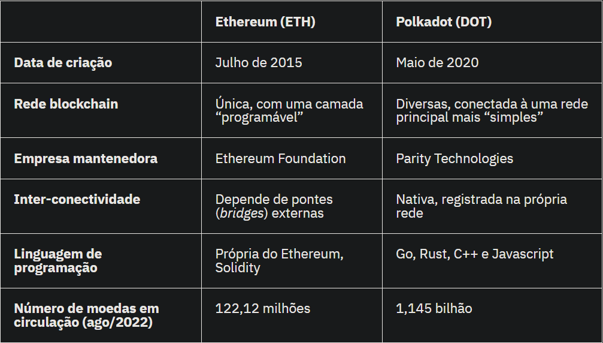

# Atividade 10/04/2024 -> 16/10/2024

- Estudar sobre Interoperabilidade em Blockchain
- Estudar sobre [Polkadots](https://polkadot.network/)

## Interoperabilidade

A interoperabilidade em blockchain é a capacidade de diferentes blockchains e sistemas de ledger distribuído (DLTs) se comunicarem e compartilharem dados de forma eficiente e segura. Isso é essencial à medida que a tecnologia blockchain amadurece e é adotada em diversos setores. No entanto, a interoperabilidade enfrenta vários desafios, incluindo a necessidade de garantir compatibilidade entre diferentes blockchains, lidar com questões de segurança e privacidade, e superar limitações de escalabilidade.

Para alcançar a interoperabilidade, várias abordagens e protocolos estão sendo desenvolvidos. Isso inclui Atomic Swaps, que permitem trocas diretas de ativos entre blockchains sem a necessidade de intermediários, e bridges, que conectam diferentes blockchains para facilitar a transferência de ativos e dados. Além disso, existem iniciativas e consórcios trabalhando no desenvolvimento de padrões para promover a interoperabilidade, como a InterWork Alliance (IWA) e a Enterprise Ethereum Alliance (EEA).

Os benefícios da interoperabilidade em blockchain são amplos e podem impactar diversos setores. Por exemplo, no setor financeiro, a interoperabilidade pode facilitar a transferência de ativos digitais entre diferentes plataformas de negociação, aumentando a liquidez e a eficiência do mercado. Na área da saúde, pode permitir o compartilhamento seguro de registros médicos entre hospitais e provedores de saúde, melhorando a coordenação do atendimento ao paciente e a interoperabilidade entre sistemas de saúde.

## Polkadots

(DOT) é a moeda digital da rede que conecta diferentes sistemas. Essa comunicação permite a transferência de informações, incluindo ativos digitais, sem possibilidade de censura.

O projeto conta com apoio da Fundação Web3, que ajuda a desenvolver protocolos digitais para uma internet independente do controle de grandes empresas e das centrais de processamento de dados.

O Polkadot é uma plataforma de blockchain projetada para facilitar a interoperabilidade entre diferentes blockchains. Ele oferece uma estrutura que permite que blockchains independentes, conhecidos como "parachains" (paracadeias), interajam entre si e com blockchains externos através de uma rede segura e escalável.

A principal inovação do Polkadot é o seu mecanismo de consenso compartilhado, chamado de "Nominated Proof-of-Stake" (NPoS), que permite que múltiplas blockchains compartilhem a mesma segurança da rede. Isso significa que as paracadeias conectadas ao Polkadot podem se beneficiar da segurança da rede principal, sem a necessidade de construir sua própria infraestrutura de segurança do zero.

Além disso, o Polkadot oferece um conjunto de ferramentas e protocolos padronizados para facilitar a interoperabilidade entre blockchains. Isso inclui o uso de "bridges" (pontes) para conectar blockchains externos ao ecossistema do Polkadot e o uso de relays para permitir a transferência de mensagens e ativos entre diferentes paracadeias de forma eficiente e segura.

Dessa forma, o Polkadot desempenha um papel importante no avanço da interoperabilidade em blockchain, fornecendo uma infraestrutura robusta e escalável para a interconexão de diferentes blockchains. Isso não apenas promove a colaboração e a inovação entre projetos blockchain, mas também permite a criação de aplicativos e serviços que podem aproveitar os recursos e dados de múltiplas blockchains de forma integrada.

### Qual a diferença entre Ethereum e Polkadot?

Ethereum e Polkadot são as duas criptomoedas voltadas para execução de aplicações descentralizadas. No entanto, Polkadot possui redes paralelas capazes de se comunicar com outras blockchains.

Embora ambas possuam capacidade de executar programas de forma automatizada, somente a Polkadot trabalha com múltiplas camadas (sharding), permitindo uma capacidade de processamento centenas de vezes maior.

### Polkadot é seguro?

O mecanismo que garante a segurança do Polkadot é a “Prova de Participação”, onde validadores da rede precisam ter certa quantidade de moedas travadas para assegurar sua honestidade.

- O staking elimina a necessidade de um alto gasto energético para garantir a segurança dos registros da tradicional mineração computacional.
- Toda vez que um novo bloco de informações é criado, são sorteados validadores dentre os depositantes.
- Para se tornar um validador existem regras, incluindo o depósito (stake) mínimo, e prazo que essas moedas devem permanecer travadas.
- Em troca desse trabalho, os validadores recebem um pagamento em criptomoedas.

A segurança deste mecanismo depende de um grande número de validadores, além da ausência de conluios. A “prova de participação” é baseada na confiança, portanto os incentivos dos participantes devem estar alinhados.

### Como funciona o blockchain do Polkadot?

O blockchain é um banco de dados distribuído, onde as informações são armazenadas na ordem cronológica. O Polkadot usa um blockchain principal que se comunica com sub-redes utilizando a tecnologia modular Substrate, desenvolvida pela Parity Technologies.

- Essa blockchain principal é apenas uma ponte (bridge) para conectar os participantes e garantir o registro final das operações.
- O poder de processamento, inclusive das aplicações descentralizadas, é responsabilidade das sub-redes (parachains).
- As sub-redes processam dados em diferentes camada de forma paralela, sem necessidade de esperar uma fila de transações.
- Polkadot dá total flexibilidade para o desenvolvimento dessas sub-redes, que se comunicam sem a necessidade de pontes (bridges) externas.

O ambiente de execução de máquinas virtuais da Polkadot foi compilado em WebAssembly (WASM), com alta capacidade de processamento, e desenvolvido em parceria com as gigantes de tecnologia Google, Apple e Microsoft.

### Quais as vantagens da “Prova de Participação”?

O Proof-of-Stake traz a alta capacidade de processamento, necessária nos smart contracts, os contratos programáveis executados de forma automática:

- Funciona sem um coordenador central ou necessidade de autorização para validar as transações.
- Incentiva o investidor de longo prazo ao exigir uma trava (lock up) de alguns dias ou semanas para participar da remuneração.
- O investimento em equipamentos para se tornar um validador é mínimo, democratizando o acesso.
- Em comparação ao gasto energético usado para minerar Bitcoin, o consumo da “Prova de Participação” é 99% menor.

### Polkadot possui limite de emissão? Quantos DOT existem?

No lançamento foram criados 1 bilhão de moedas DOT, dos quais 58.4% foram reservados para investidores e 41.6% ficaram com a Web3 Foundation para continuar financiando o desenvolvimento do projeto.

No final de agosto de 2022, existiam 1,146 bilhão de moedas Polkadot em circulação, pois o projeto atualmente conta com uma inflação equivalente de 10% ao ano para remunerar os validadores.

### Quem criou Polkadot?

O principal mentor da Polkadot é Gavin Wood, co-fundador da criptomoeda Ethereum, e principal criador da linguagem de programação Solidity. Em meados de 2016, Gavin publicou um estudo sobre sua versão alternativa do Ethereum, que contaria com múltiplas camadas:

- O projeto inicial do Polkadot foi desenhado em outubro de 2016, no lançamento de seu estudo definitivo (whitepaper).
- Em 2017, Gavin se juntou a Peter Czaban da Parity Technology para criar a Web3 Foundation, que levantou 145 milhões de dólares para a Polkadot.
- Uma falha no código-fonte do contrato auto-executável (smart contract) da Parity congelou para sempre 64% do capital levantado na oferta.
- Em meados de 2019, a Fundação Web3 realizou uma venda privada para investidores levantando cerca de 60 milhões de dólares.
  
Embora a rede Polkadot tenha mantido uma versão de testes desde maio de 2018, foi somente em maio de 2020 que sua rede oficial foi lançada, migrando para o sistema de validadores e governança em agosto de 2020.
  
### O que é uma cooperativa (pool) de validadores?

O sistema de “Prova de Participação” exige um depósito mínimo de moedas para se tornar um validador. Por isso, formam-se cooperativas (pools) onde investidores se unem para apoiar determinada entidade:

- Existe uma disputa pelo staking, a remuneração do serviço de validação, e quanto maior o depósito (stake), maiores as chances.
- A cooperativa distribui a premiação entre os participantes de forma proporcional aos depósitos.
- Se falhar na verificação, esse validador corre o risco de perder suas moedas depositadas de garantia.

### O que é Substrate?

Substrate é uma arquitetura para desenvolvimento de blockchains interoperacionais. Este projeto liderado pela Parity Technologies é a base da rede Polkadot, permitindo a integração e lançamento de projetos e serviços nas sub-redes.

- Substrate é pensado no usuário final, portanto pode ser acessado pelo navegador de smartphones e PCs.
- Sua arquitetura modular torna os upgrades mais simples e abrangentes.
- Existem módulos prontos para oferecer governança, comunicação com blockchains externas, e [Escalabilidade](https://www.mercadobitcoin.com.br/economia-digital/investimentos/escalabilidade-um-problema-a-ser-resolvido/)

### Investimento em Polkadot vale a pena?

Embora seja uma das 10 maiores criptomoedas em valor de mercado, as funções primárias do Polkadot envolvem o próprio ecossistema, atuando como reserva de garantia, pagamento de taxas, e direito de voto:

- Polkadot (DOT) é um investimento de risco, pois sua cotação varia conforme a oferta e demanda em cada instante, algo imprevisível.
- O ecossistema Polkadot é nascente, embora em constante desenvolvimento e contando com investimento de grupos experientes.
- Seus concorrentes possuem 2 ou mais anos de histórico de funcionamento com aplicações descentralizadas.

Não é possível fazer previsões de longo prazo para o Polkadot, pois a criptomoeda está no meio do processo de testes e implementação das sub-redes, fundamentais para o sucesso do projeto.

## References

[O que é o polkadot](https://www.mercadobitcoin.com.br/economia-digital/criptomoedas/o-que-e-polkadot/)
